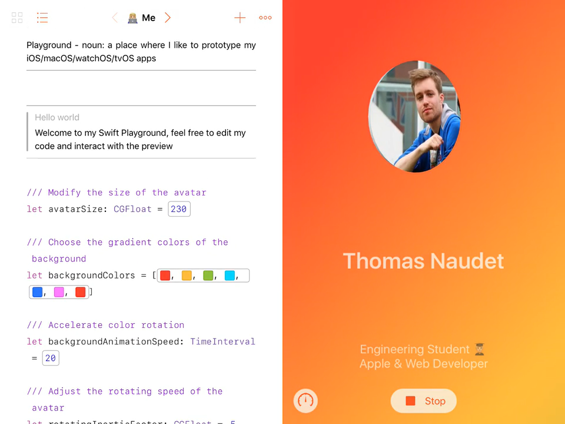

# WWDC’17 Scholarship Submission

## Preview

[▶️ Click to play the video](https://youtu.be/w5SfOVPmK_U)

## Description

> This is the Swift Playgrounds Book I submitted as a scholarship application for Apple World Wide Developer Conference 2017.
> 
> This book contains 3 chapters:
> 
> - Hello world
>   - *Me* — a spinning avatar
>   - *Travel the World* — countries I visited/lived
> - My Projects
>   - *First Steps* — (with Apple technologies) tilt the device for a tvOS-parallax style
>   - *Tramigo* — my 1st iOS app
>   - *Students’ Union* — tap the icon to see the features
>   - *Space game · Students’ Union* — tilt & tap to fly the ship
>   - *Fruity game · Students’ Union* — slash the fruits!
>   - *DigiSheep* — shows how the app scans tickets
>   - *Subtle Subtitles* — simulation of my subtitles player
> - Looking forward
>   - *Skills* — sweep the bubbles
>   - *Hobbies* — play with the tennis balls
>   - *WWDC* — tap to gather the developers

## Technologies used

- SceneKit
- SpriteKit
- Physics, contact, velocity, gravity, collision, dynamic behaviors
- Core Motion
- Core Animation
- Core Graphics
- AVFoundation
- MapKit (MKTileOverlay, MKAnnotation…)
- UIKit (pop-overs, UIView.animations, gesture controllers…)
- Auto Layout, UIStackView, constraints
- PlaygroundSupport
- *URLSession*
- *Xcode Scene Editor*
- *GarageBand*

## Usage
`Tomn.playgroundbook` runs on iPad in Apple Swift Playgrounds app.\
All pages can also be run separately in Xcode if included in a `.playground` file.

*Uses Swift 3.1*

## Licence

*Everything is home-made (March 2017), except map tiles, fonts & WWDC sprites.*

    Copyright © 2017 Thomas NAUDET

    This program is free software: you can redistribute it and/or modify
    it under the terms of the GNU General Public License as published by
    the Free Software Foundation, either version 3 of the License, or
    (at your option) any later version.

    This program is distributed in the hope that it will be useful,
    but WITHOUT ANY WARRANTY; without even the implied warranty of
    MERCHANTABILITY or FITNESS FOR A PARTICULAR PURPOSE.  See the
    GNU General Public License for more details.

    You should have received a copy of the GNU General Public License
    along with this program. If not, see http://www.gnu.org/licenses/
